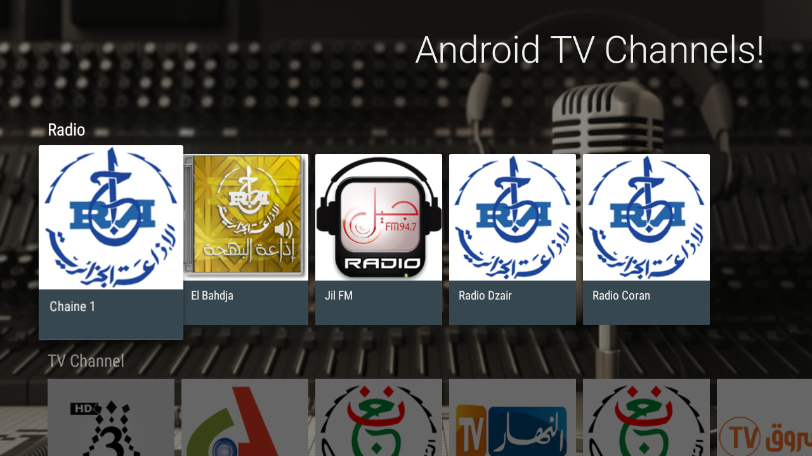
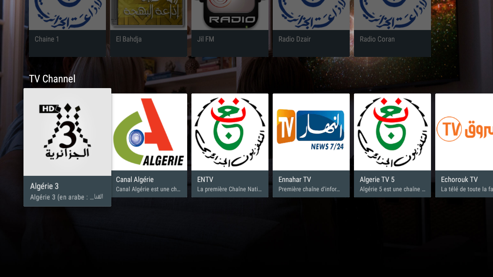
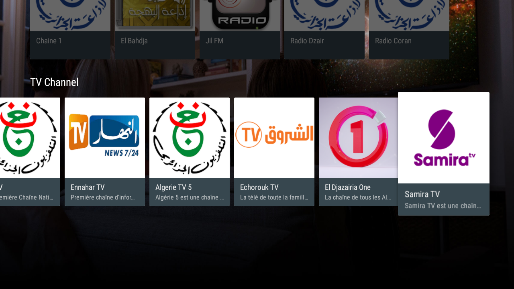

# Radio and TV Live Stream -Android TV App

This is a simple Android TV App for streaming live TV and Radio channels, it can be used to stream videos as well. 
<br>The video player used is based on Exo Player. 

## Screenshots

[](screenshots/screenshot_1.png)
[](screenshots/screenshot_2.png)
[](screenshots/screenshot_3.png)
<br><br>
[](screenshots/screenshot_4.gif)


## Setup
Clone this repository and import into **Android Studio**
```bash
git clone https://github.com/islem19/TV-Live-Stream.git
```

## Permissions
The App requires the following permissions:
- Internet access.

## Libraries and Dependencies
- [Leanback Library](https://developer.android.com/reference/android/support/v17/leanback/package-summary)
- [Glide](https://github.com/bumptech/glide)
- [Exo Player](https://github.com/google/ExoPlayer)
- [Gson](https://github.com/google/gson)


## Maintainers
This project is mantained by:
* [Abdelkader Sellami](https://github.com/islem19)


## Contributing

1. Fork it
2. Create your feature branch (git checkout -b my-new-feature)
3. Commit your changes (git commit -m 'Add some feature')
4. Push your branch (git push origin my-new-feature)
5. Create a new Pull Request


## License
This application is released under GNU GPLv3 (see [LICENSE](https://github.com/islem19/TV-Live-Stream/blob/develop/LICENSE)). Some of the used libraries are released under different licenses.
